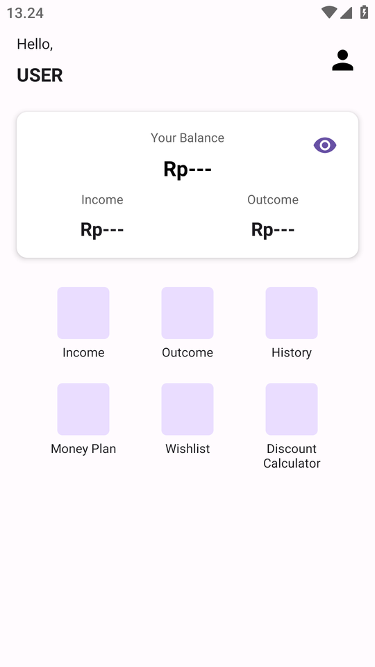

# Montra

Sebuah app yang mencatat uang anda.

## Library yang digunakan pada project ini:
1. [Hilt](https://dagger.dev/hilt/) for Dependency Injection
2. [Room](https://developer.android.com/training/data-storage/room) for Local Database
5. Used AndroidX, Material Design Components 3, ViewModel, and any more libraries

## Sumber Data yang digunakan:
- Room (Local Database)

## Fitur-fitur yang ada di GGame:
- CRUD history uang

## Screenshoots
|                                              |                                                     |
| -------------------------------------------- | --------------------------------------------------- |
|                   |  |
| Home                                         | Add Report                                    |
|                   |
| History                                         |

## Preview
-

## Next Update
- App Icon
- About
- Wishlist